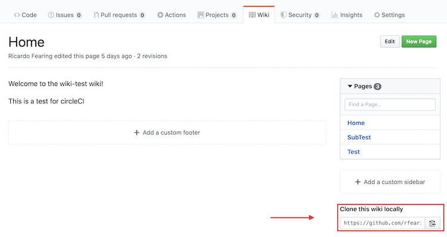
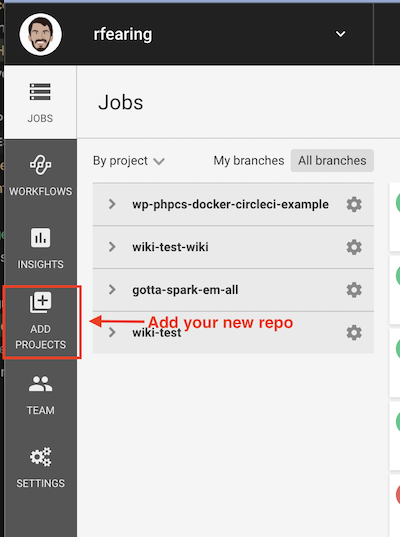

# GitHub Wiki circle**ci** Integration Example.

This is a proof of concept. GitHub Wikis are great. According to GitHub:

>  - README files are a quick and simple way for other users to learn more about your work.
>  - Wikis on GitHub help you present in-depth information about your project in a useful way.
>  - It’s a good idea to at least have a README on your project, because it’s the first thing many people will read when they first find your work.

Wikis can be forked and pulled down to edit locally, but the main problem, however, arises if you're working with a team. You can't submit a PR to your wiki.

This concept addresses that issue. Before beginning, you'll need to have signed up for circle**ci** or have your organization sign up for circle**ci**.

Steps to introduce into your project's wiki:

1. `git clone <repo wiki url>` (see screenshot below)
1. Rename with <repo.wiki> to <name-of-repo>-wiki
    - e.g. `mv example-project` to `example-project-wiki`
1. Create an empty repo in github (with the same name as you renamed above)
1. Remove original repo origin
    - `git remote remove origin`
1. Add the new origin
    - `git remote add origin <new repo url>`
1. Generate a GitHub personal access token with write access to the project in the original repo. See [GitHub Docs](https://help.github.com/en/enterprise/2.17/user/github/authenticating-to-github/creating-a-personal-access-token-for-the-command-line) and screenshot below.
1. Add your new repo as a circle**ci** Project, in the circle**ci** Dashboard. See [circle**ci** Docs](https://circleci.com/docs/enterprise/quick-start/)
1. Add a `.circleci` directory and a `config.yml` file in that directory locally.
1. Fill the config with following. (*Note that any output generated by the command is redirected to `/dev/null` so that secrets never show up in the build log.*). You can see the config in this repo as an example.
    ```yaml
    version: 2.1
    description: Automatically build and push to your GitHub Repo Wiki

    jobs:
      build:
        docker:
          - image: circleci/node
        steps:
          - checkout
          - run:
              name: Push Wiki To Project Wiki
              command: |
                git config user.email "${GITHUB_EMAIL}"
                git config user.name "${GITHUB_USERNAME}"
                git remote remove origin
                git remote add origin https://${GITHUB_API_KEY}@github.com/<github-username>/<original-repo-wiki.git> > /dev/null 2>&1
                git push origin master > /dev/null 2>&1

    workflows:
      main:
        jobs:
          - build:
              filters:
                branches:
                  only: master
    ```
1. Push to your new repo.
    - `git add .`
    - `git commit -m "Add circleCI config"`
    - `git push -u origin master`

### Now What?
Now, users can submit Pull Requests onto your new repo. If merged into master, changes will be pushed to the original repo's wiki. One thing to note, that if you rewrite history, this will fail. You can change:
  - `git push origin master > /dev/null 2>&1`

to

  - `git push origin master -f > /dev/null 2>&1`

in the `config.yml` file to allow for rewriting history.


### Screenshots:

**Clone Wiki:**
<p></p>

**CircleCI Add Project:**
<p></p>

**GitHub Personal Access Token:**
<p></p>